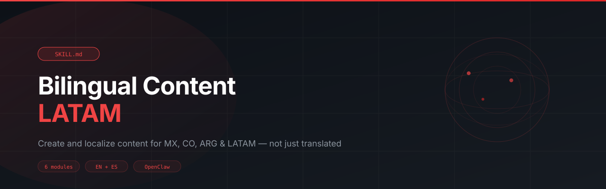

# bilingual-content-latam



> SKILL.md for AI agents — Create and localize marketing content for Spanish-speaking LATAM audiences. Covers MX, CO, ARG cultural adaptation, Web3 crypto content in Spanish, bilingual social strategy, and copy review. Not translation — localization.

---

## Install

```
clawhub skill install bilingual-content-latam
```

Or paste the repo URL directly into your OpenClaw chat and the agent will install it automatically.

---

## What it does

6 modules, all in one skill:

| Module | What it solves |
| --- | --- |
| **Localization Engine** | Adapt English content for LATAM — culturally, not literally |
| **Bilingual Campaign Strategy** | Plan campaigns that work in EN and ES without doubling the work |
| **Country-Specific Content** | Tone, idioms, and cultural context for Mexico, Colombia, and Argentina |
| **Web3 LATAM Module** | Crypto terminology in Spanish and content angles that resonate in the region |
| **Copy Review & Quality Check** | 8-point framework to verify Spanish content before publishing |
| **Bilingual Social Content** | Matched EN/ES post pairs with platform timing by market |

---

## Who it's for

Marketing strategists, content creators, and brand managers serving Spanish-speaking and LATAM audiences — especially in crypto, fintech, and tech.

---

## File structure

```
bilingual-content-latam/
└── SKILL.md    ← Full skill (6 modules)
```

---

## Built with

- [OpenClaw](https://openclaw.ai)
- [ClawHub](https://clawhub.ai)

---

## License

MIT
